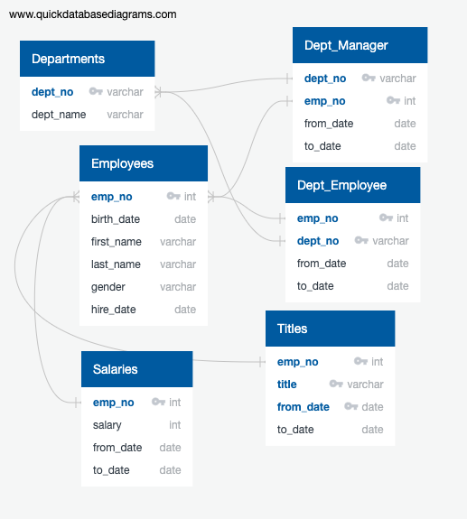
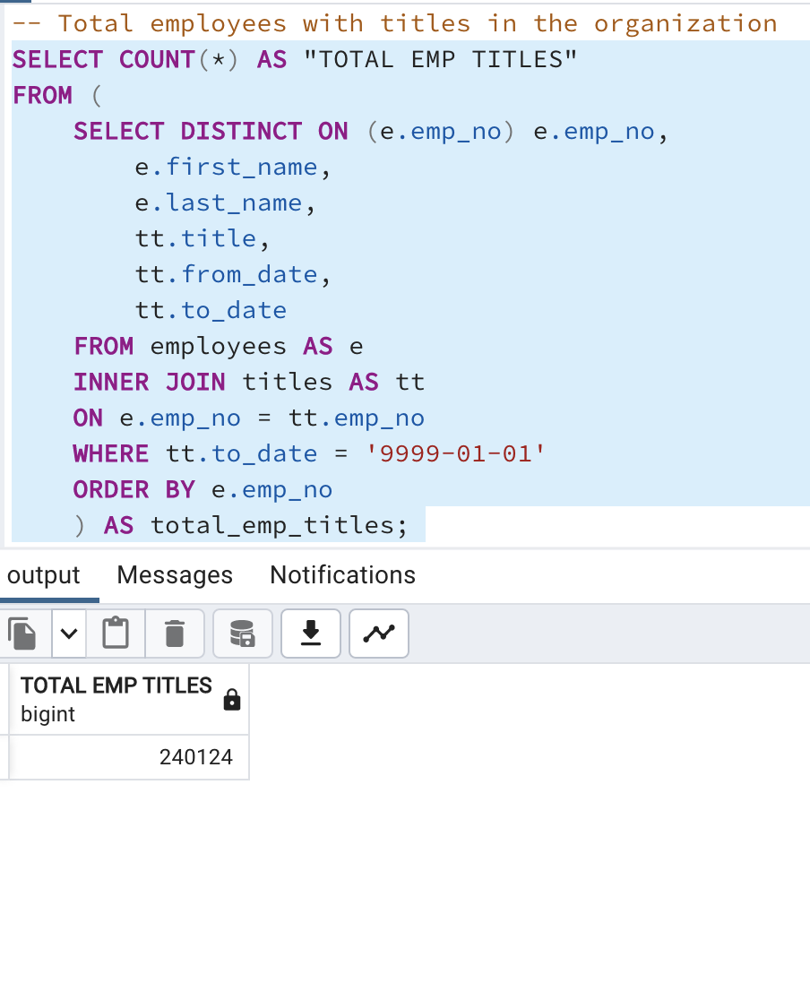
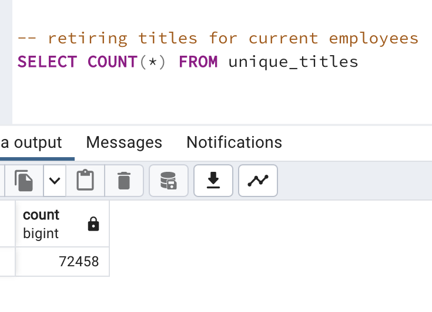

# Pewlett-Hackard-Analysis

## Overview of Analysis
An HR analyst of a large firm with thousands of employees was asked to perform employee research as follows:
- Build an employee database for the organization using SQL.
- Determine the employees retiring in the next few years.
- Determine the positions that need to be filled in the near future.
- Determine the number of retiring employees per title.
- Identify employees who are eligible to participate in a mentorship program.

## Resources

- PostgreSQL and pgAdmin
- Quick DBD
- Client resources: CSV files

## Results
- Below is the entity relationship diagram of the organization's employee database.

- Any current employee of the company born between Jan-01-1952 and Dec-31-1955 would be eligible for retirement. The hire date requirement to determine retirement eligibility implemented in modules was not considered for this analysis. All the employees in the organization hold 240124 titles while the retiring employees hold 72458 titles. This shows that 30% of the titles are held by retiring employees.
<table>
  <tr>
    <td></td>
    <td></td>
  </tr>
</table>

- 36% of retiring employees hold Senior Engineer title while 34% hold Senior Staff title. 70% of titles need to be filled if these employees choose to retire in the next few years.

## Summary
High level responses to:
- How many roles will need to be filled as the "silver tsunami" begins to make an impact?
- Are there enough qualified, retirement-ready employees in the departments to mentor the next generation of Pewlett Hackard employees?

Provide two additional queries or tables that may provide more insight into the upcoming "silver tsunami."
