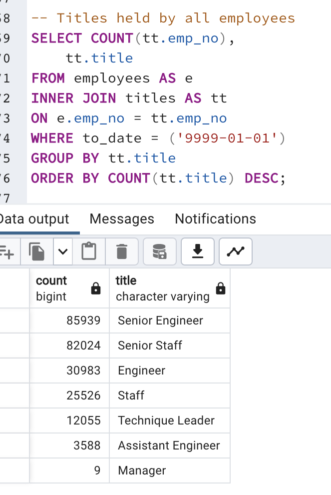
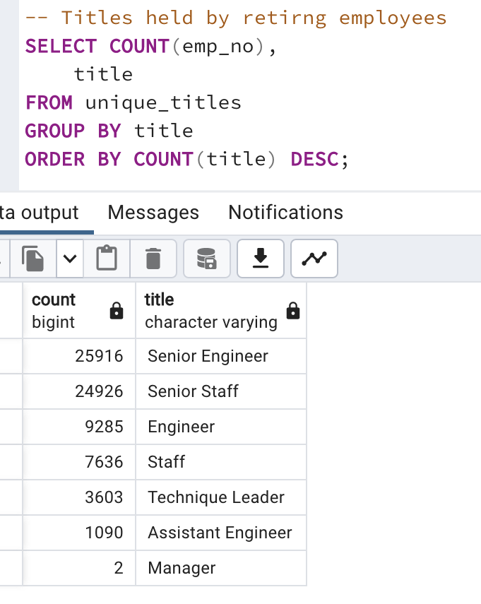
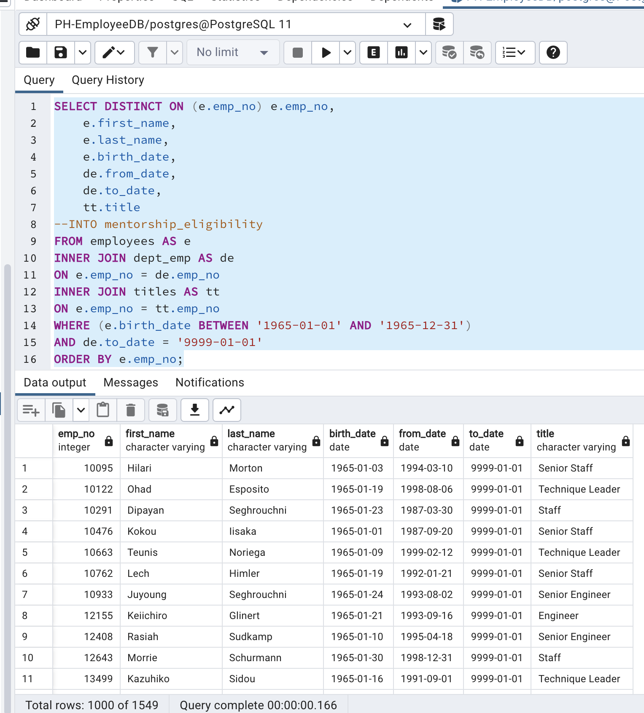
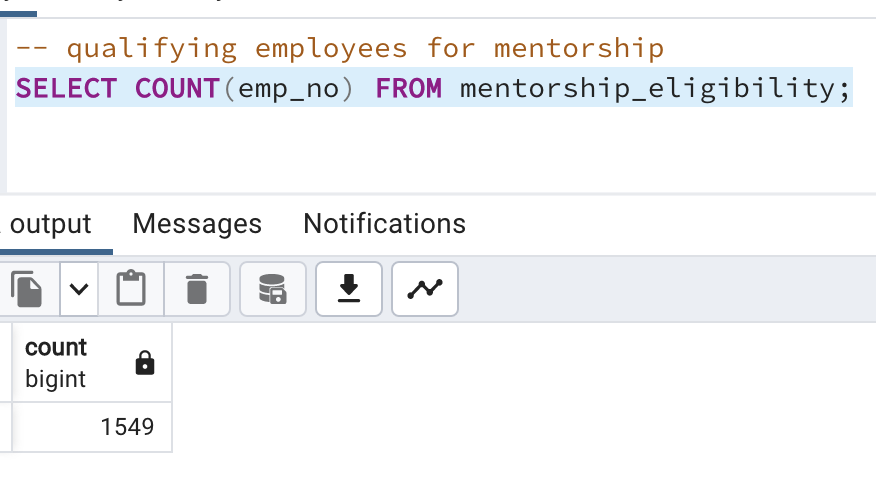

# Pewlett-Hackard-Analysis

## Overview of Analysis
An HR analyst of a large firm with thousands of employees was asked to perform employee research as follows:
- Build an employee database for the organization using SQL.
- Determine the employees retiring in the next few years.
- Determine the positions that need to be filled in the near future.
- Determine the number of retiring employees per title.
- Identify employees who are eligible to participate in a mentorship program.

## Resources

- PostgreSQL and pgAdmin
- Quick DBD
- Client resources: CSV files

## Results
- Below is the entity relationship diagram of the organization's employee database.

- Any current employee of the company born between Jan-01-1952 and Dec-31-1955 would be eligible for retirement. The hire date requirement for retirement eligibility implemented in modules was not considered for this analysis. With that in view, the employees eligible for retirement were identified along with their current designations. The retiring employees had 72,458 titles compared to 240,124 titles held by all the employees in the organization. It can be concluded that 30% of the titles were held by retiring employees in the organization.
<table>
  <tr>
    <td></td>
    <td></td>
  </tr>
</table>

- When retiring employees were grouped by titles, 25,916 of them hold Senior Engineer title while 24,926 of them hold Senior Staff title. It can be concluded that 70% of titles held by retiring employees account to Senior positions. 
- The organization had 167,963 Senior positions in total and 30% of these Senior titles were held by retiring employees.
<table>
  <tr>
    <td></td>
    <td></td>
  </tr>
</table>

- The number of retiring employees eligible for mentorship program was 1549.
<table>
  <tr>
    <td></td>
    <td></td>
  </tr>
</table>

## Summary

- As presented in the analysis above, the total number of current employees in the organization was 240,124. A total of 72,458 roles need to be filled when broken down by title.
- The total count of retiring employees eligible for mentorship program was 1549. Since only 2% of the total retirement ready employees qualify for mentorship program, the organization would have to go through an extensive hiring process to fill in the remaining roles.
- In order to help the organization get most out of the mentorship program, a list of all young employees and their positions with the company could be pulled using SQL queries. Additionally, the duration of each young employee in his/her current role could be determined inorder to be assigned to potential mentors from the retiring group.
